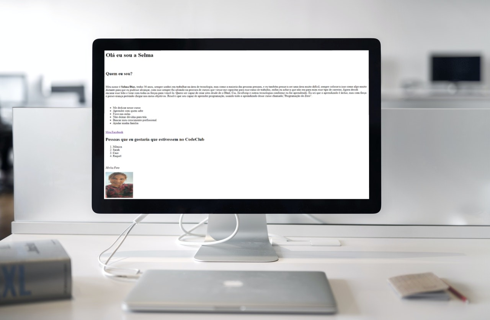

# Sobre Mim.

> Meu primeiro exemplo de html.

### Aprendendo sobre Html

O projeto foi voltado nas seguintes tarefas:

- [x] Falar sobre mim
- [x] Focar nos meus objetivos
- [x] Usar tags de títulos, parágrafos, strong,listas
- [ ] Convidar pessoas
- [ ] Crescer no aprendizado

## 🚀 Aprendendo sobre :

   

## 🤝 Colaborador

<table>
  <tr>
    <td align="center">
      <a href="#">
         
        
          <b>Selma Dias</b>
        
      </a>
    </td>
  </tr>
</table>

[⬆ Voltar ao topo](#test) 
